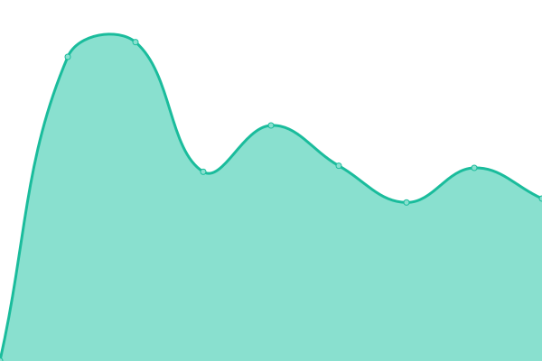

# [📈 Live Status](https://ldunkum.github.io/status/): <!--live status--> **🟧 Partial outage**

This repository contains a status page for my selfhosted applications. It's powered by [Upptime](https://github.com/upptime/upptime).

<!--start: status pages-->
<!-- This summary is generated by Upptime (https://github.com/upptime/upptime) -->
<!-- Do not edit this manually, your changes will be overwritten -->
<!-- prettier-ignore -->
| URL | Status | History | Response Time | Uptime |
| --- | ------ | ------- | ------------- | ------ |
|  Nextcloud | 🟥 Down | [nextcloud.yml](https://github.com/ldunkum/status/commits/HEAD/history/nextcloud.yml) | 

 1426ms
     
 | 

<a href="https://ldunkum.github.io/status/history/nextcloud">53.12%</a>
    

|  Bitwarden | 🟥 Down | [bitwarden.yml](https://github.com/ldunkum/status/commits/HEAD/history/bitwarden.yml) | 

 665ms
     
 | 

<a href="https://ldunkum.github.io/status/history/bitwarden">53.13%</a>
    

|  AWS test moodle instance | 🟩 Up | [aws-test-moodle-instance.yml](https://github.com/ldunkum/status/commits/HEAD/history/aws-test-moodle-instance.yml) | 

 378ms
     
 | 

<a href="https://ldunkum.github.io/status/history/aws-test-moodle-instance">100.00%</a>
    

|  TR HTML Prototype | 🟩 Up | [tr-html-prototype.yml](https://github.com/ldunkum/status/commits/HEAD/history/tr-html-prototype.yml) | 

 841ms
     
 | 

<a href="https://ldunkum.github.io/status/history/tr-html-prototype">100.00%</a>
    

|  TR OPEN | 🟩 Up | [tr-open.yml](https://github.com/ldunkum/status/commits/HEAD/history/tr-open.yml) | 

 889ms
     
 | 

<a href="https://ldunkum.github.io/status/history/tr-open">100.00%</a>
    

|  TR Main | 🟩 Up | [tr-main.yml](https://github.com/ldunkum/status/commits/HEAD/history/tr-main.yml) | 

 988ms
     
 | 

<a href="https://ldunkum.github.io/status/history/tr-main">100.00%</a>
    

|  TR GITLAB | 🟩 Up | [tr-gitlab.yml](https://github.com/ldunkum/status/commits/HEAD/history/tr-gitlab.yml) | 

 1259ms
     
 | 

<a href="https://ldunkum.github.io/status/history/tr-gitlab">100.00%</a>
    

|  TR Canvas | 🟥 Down | [tr-canvas.yml](https://github.com/ldunkum/status/commits/HEAD/history/tr-canvas.yml) | 

 734ms
     
 | 

<a href="https://ldunkum.github.io/status/history/tr-canvas">0.00%</a>
    

<!--end: status pages-->

## 📄 License

- Powered by: [Upptime](https://github.com/upptime/upptime)
- Code: [MIT](./LICENSE) © [Upptime](https://upptime.js.org)
- Data in the `./history` directory: [Open Database License](https://opendatacommons.org/licenses/odbl/1-0/)
